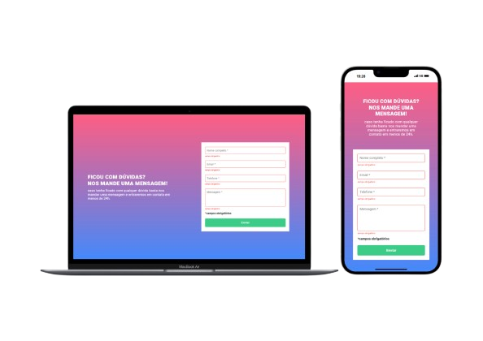

# Formulário com validação

- [View Website](https://pedrowfilho.github.io/formulario-js/) 🖱️

## Visão Geral

### Desafio

Este é um desafio do Dev Quest - Dev em Dobro - Desenvolvimento Web Full Stack, cujo objetivo é criar um formulário com validação utilizando JavaScript.

### Habilidades/Técnicas

- JavaScript
- HTML
- CSS
- Flexbox
- Git

## Autor

Pedro Wagner - Front End Developer

